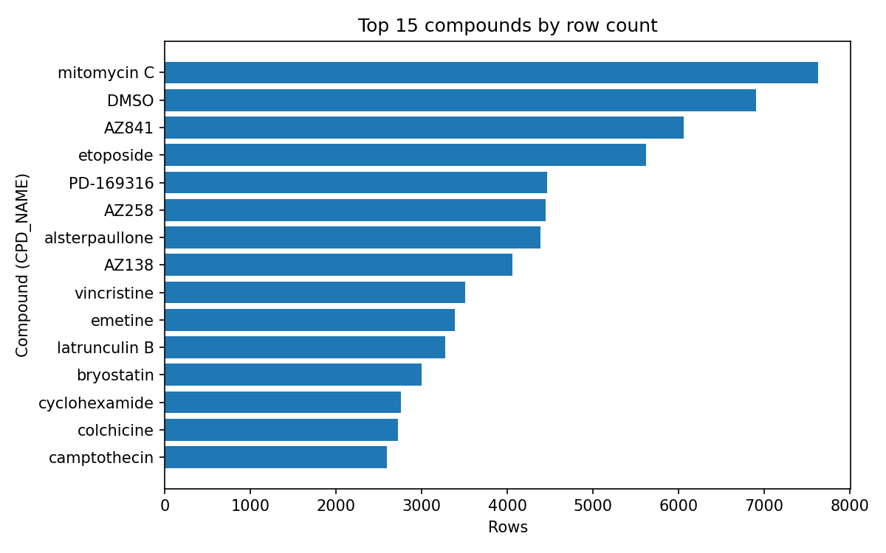
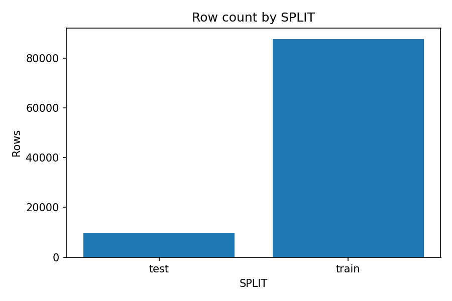
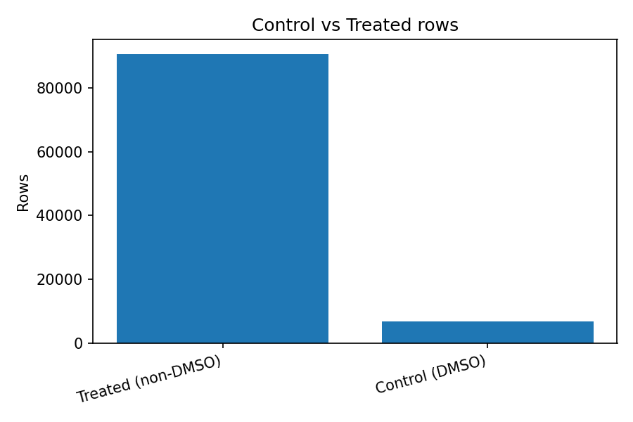
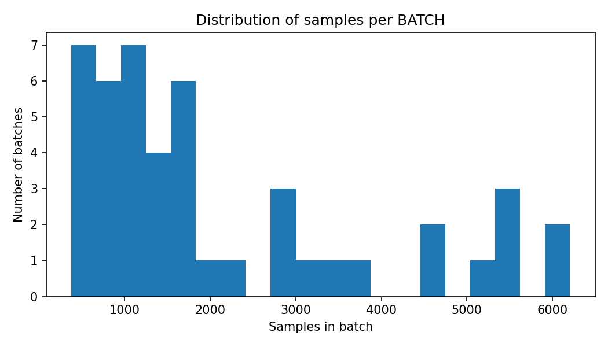

# A Deep Dive into the BBBC021 Morphological Profiling Dataset: Structure, Labeling, and Pairing Strategy

---

## 1. Introduction

High-content microscopy datasets have become foundational for modern computational biology and machine learning. Among them, **BBBC021** stands out as a carefully designed benchmark for studying how chemical perturbations alter cellular morphology.

Unlike traditional image datasets used for classification, BBBC021 encodes a *biological experiment* rather than a simple label-to-image mapping. Each image represents a single cell observed under a specific chemical condition, dose, and experimental batch. Understanding how this structure is reflected in the dataset—and how it is used during training—is critical for building reliable models.

This post provides a deep dive into the **structure**, **labeling scheme**, and **control–treatment pairing strategy** used in BBBC021, with a focus on how the dataset supports conditional generative modeling.

---

## 2. What Is BBBC021?

BBBC021 is a **morphological profiling dataset** derived from high-content screening experiments. Cells are exposed to a library of chemical compounds, imaged using fluorescence microscopy, segmented, and stored as **single-cell image crops**.

Each crop captures subtle morphological changes induced by chemical perturbations, such as:

* cytoskeletal reorganization,
* DNA damage,
* microtubule destabilization,
* protein synthesis inhibition.

The dataset is distributed not as a flat collection of images, but as a **CSV-indexed experiment**, where each row describes one biological observation.

---

## 3. One Row = One Biological Event

A key concept when working with BBBC021 is:

> **Each row in the CSV corresponds to one cell observed under one experimental condition.**

That single row connects:

* an image on disk,
* a chemical perturbation,
* a dose level,
* a biological annotation,
* and a specific experimental batch.

---

## 4. Understanding the Dataset Columns

The metadata CSV acts as a **relational index** into the experiment. Its columns can be grouped by function:

### Identifiers and Experimental Context

* **`SAMPLE_KEY`** – a unique identifier encoding week, plate, image, and object index.
* **`BATCH` / `PLATE`** – define the experimental batch.
* **`TABLE_NUMBER`, `IMAGE_NUMBER`, `OBJECT_NUMBER`** – locate the cell within the original microscope image.

### Chemical Information

* **`CPD_NAME`** – the applied compound (e.g., *cytochalasin B* or *DMSO*).
* **`SMILES`** – chemical structure string.
* **`DOSE`** – concentration of the compound.
* **`ANNOT`** – biological mechanism of action (e.g., *Actin disruptors*).

### Dataset Split

* **`SPLIT`** – assigns each row to `train` or `test`.

Together, these columns ensure every image is fully contextualized biologically and experimentally.

---

## 5. Dataset Scale and Integrity

A summary of the dataset reveals a well-curated resource:

* **97,504** single-cell images
* **35** unique compounds (including DMSO)
* **46** experimental batches
* **13** biological annotation categories
* **0 missing values**
* **0 duplicate SAMPLE_KEY entries**

The dataset is split into ~90% training data and ~10% test data. Importantly, this split is **balanced across compounds and batches**, reducing the risk of data leakage.

*Figure 1: Distribution of the top compounds in the dataset. This visualization confirms that while some treatments are more frequent, the dataset covers a diverse range of chemical perturbations.*

*Figure 2: The train/test split counts. The rigorous splitting strategy ensures that the extensive training set (blue) is well-validated by the hold-out test set (orange).*

---

## 6. Control vs Treated: The Labeling Strategy

BBBC021 does not use class labels in the traditional sense. Instead, it defines **experimental roles**:

* **Control cells**:
  Cells treated with **DMSO**, the vehicle solvent.

* **Treated cells**:
  Cells treated with **any non-DMSO compound**.

DMSO induces minimal morphological change and serves as a **reference state**. All other compounds introduce perturbations relative to this baseline.

Crucially:

* Every batch contains **exactly 150 DMSO control cells**.
* No batch is missing controls.

This design allows robust within-batch comparisons.

*Figure 3: Count comparison between DMSO control samples and treated samples. The abundance of treated samples relative to controls necessitates the stochastic pairing strategy described below.*

---

## 7. Why Batch Structure Matters

Biological imaging data is notoriously sensitive to **batch effects**—systematic differences caused by plate conditions, staining intensity, or imaging settings.

BBBC021 explicitly encodes batch identity and ensures that:

* controls and treatments are always compared **within the same batch**,
* batch-specific artifacts are not mistaken for biological signal.

This makes batch-aware pairing not just a technical choice, but a biological necessity.

*Figure 4: Histogram of batch sizes. The variability in the number of samples per batch highlights the importance of batch-aware processing to normalize experimental conditions.*

---

## 8. The Control–Treatment Pairing Strategy

Perhaps the most important design choice is **how images are paired during training**.

### Key idea

> **Pairing is treatment-centric, not control-centric.**

The process works as follows:

1. Training iterates **only over treated cells**.
2. For each treated cell:

   * identify its batch,
   * randomly sample **one DMSO control cell** from the same batch.
3. Form a `(control, treated)` pair.
4. Repeat this process **stochastically at every iteration**.

There is **no fixed one-to-one mapping** between control and treated cells. Control cells form a shared reference pool and are reused many times.

This stochastic pairing:

* averages over nuisance variability in controls,
* prevents overfitting to specific control images,
* reflects the experimental reality that controls are interchangeable references.

---

## 9. Chemical Conditioning via Molecular Fingerprints

Chemical identity is not represented as a categorical label. Instead:

* `SMILES` strings are converted into **Morgan fingerprints**.
* Each compound is mapped to a fixed-length vector.
* This vector conditions the model during training.

As a result, the model learns not just *that* a cell is treated, but *which chemical structure* caused the perturbation.

---

## 10. Dose Information: Present but Marginalized

The dataset includes **18 distinct dose levels**, and many compounds appear at multiple concentrations. However, in the baseline setup:

* dose is **not used as a conditioning variable**,
* the model learns an *average morphological effect per compound*.

This is a deliberate modeling choice that simplifies the learning problem, while leaving room for future extensions such as dose-aware conditioning.

---

## 11. What BBBC021 Is—and Is Not

**BBBC021 is:**

* a conditional generative dataset,
* batch-aware and biologically grounded,
* designed for perturbation modeling.

**BBBC021 is not:**

* a standard image classification dataset,
* a one-to-one paired dataset,
* a dose-explicit benchmark (by default).

Understanding this distinction is essential for using the dataset correctly.

---

## 12. Conclusion

BBBC021 exemplifies how biological experiments can be translated into machine-learning-ready datasets without sacrificing scientific rigor. Its careful labeling of controls, explicit batch structure, and stochastic pairing strategy make it particularly well suited for **conditional generative modeling of cellular morphology**.

By treating DMSO as a shared reference state and learning perturbation effects relative to that baseline, models trained on BBBC021 can capture meaningful, biologically interpretable transformations—moving beyond labels toward mechanism-aware representations.
